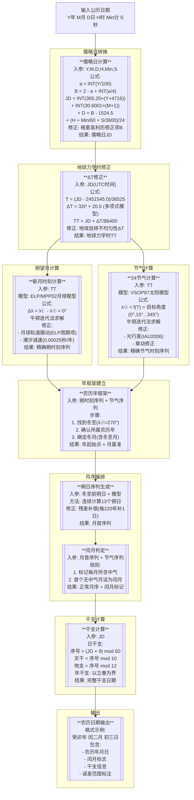

# 农历计算步骤

> 其它资料:
> - [天文算法](https://mooncaker816.github.io/tags/%E5%A4%A9%E6%96%87%E7%AE%97%E6%B3%95/)
> - [黄道经度的测定](https://farside.ph.utexas.edu/Books/Syntaxis/Almagest/node34.html)
> - [.NET Core计算行星位置(1)——VSOP 2013 概论](https://zhuanlan.zhihu.com/p/90756402)
> - [天文学基础（时间和历法）](https://sirlis.cn/posts/astronomy-basic-time-calender)

## 农历计算步骤概览



## 儒略日转换

儒略日（Julian Day，JD）表示从公元前4713年1月1日正午开始的连续天数。

由于它没有其它历法那样复杂的规则，而且只有一项数据，而其它历法通常需要年、月、日等多项数据，

最重要的是，儒略日直接表示天数，可以说是历法的本质或者共同表示。

公式:
$$
\begin{align*}
JD & = \lfloor 365.25 \cdot (Y + 4716) \rfloor + \lfloor 30.6001 \cdot (M + 1) \rfloor + D + B - 1524.5 + \frac{H}{24} + \frac{\text{Min}}{1440} + \frac{S}{86400} \\
B & = 2 - \lfloor \frac{Y}{100} \rfloor + \lfloor \frac{\lfloor \frac{Y}{100} \rfloor}{4} \rfloor
\end{align*}
$$

其中:

- Y: 公历年（如2023）。
- M: 公历月（1-12）。
- D: 公历日（1-31）。
- H: 时（0-23）。
- Min: 分（0-59）。
- S: 秒（0-59）。
- B: 格里高利历修正项。

## 地球力学时与修正

由于儒略日是基于协调世界时（UTC）或国际原子时（TAI）计算的，但是UTC受地球自转不均匀性（潮汐摩擦、地核运动等）影响，

从而导致UTC不是地球真正经历的时间，也因此UTC需要通过添加闰秒来进行修正。

那么UTC修正的目标正是地球力学时（Terrestrial Time，TT），它是一个更接近地球自转的时间系统，也就是更接近地球正真经历的时间。

TT与UTC的关系可以通过$\Delta T$来表示。

其严格表示:
$$
\begin{align*}
\Delta T & = TT - UTC \\
\Delta T & = 32.184 + \Delta AT + DUT1
\end{align*}
$$

其中:

- 32.184秒是TT与TAI（Temps Atomique International. 原子时）的固定差值，属于历史遗留偏移。
- $\Delta AT$: 阶梯变化，是闰秒积累的结果。也等于TAI - UTC。
- DUT1: 地球自转短期变化的修正，通常在-0.9到+0.9秒之间。

为了说明各时间复杂的关系，参考下图


但是在实际计算中，我们一般不直接使用$\Delta T$的复杂公式，而是数学模型来近似计算$\Delta T$。

需要提前说明的是，由于地球自转的不均匀性是不可预测也没有规律的，所以近似的$\Delta T$模型一般会对某些特定时间段进行拟合。

- 2005 - 2050（误差$\pm 1$秒）:
  $$
  \Delta T = 69.92 + 0.32217 \cdot (y - 2005) + 0.005589 \cdot (y - 2005)^2
  $$
  其中:
    - y: 年份 + (月份 - 0.5) / 12。

- 2000 - 2100（误差$\pm 5$秒）:
  $$
  \Delta T = 70.6 + 0.36 \cdot (y - 2010)
  $$
- 1800 - 2020（误差$\pm <1$秒）:
  $$
  \Delta T = -18.328 + 123.5 \cdot t + 32.5 \cdot t^2
  $$
- 1600 - 1800（误差$\pm 2$秒）:
  $$
  \Delta T = 120.3 - 98.8 \cdot t + 52.4 \cdot t^2
  $$

- NASA的五次项拟合，参见[Polynomial Expressions for Delta T (ΔT)](https://eclipse.gsfc.nasa.gov/SEcat5/deltatpoly.html)

- 长期演化模型（含潮汐减速）:
  $$
  \Delta T \approx 31 \cdot (y - 1820)^2 \quad \text{其中} (y > 1820)
  $$

> - 短期高精度：使用 Espenak 多项式（2005–2050）。
> - 历史研究：采用 van Gent 分段模型 或查表。
> - 关键资源：NASA ΔT 多项式 和 IERS EOP 数据。

## 朔望月计算

首先需要理解农历的基本概念。

----

### 农历规则

农历是一种阴阳合历，阴阳合历是指既有阴历（基于月亮的周期）又有阳历（基于太阳的周期）。

并且农历不是数学历法（仅通过数计算），而是天文学历法（需要通过天文观测数据和计算来确定）。

#### 第一步: 定气

二十四节气是农历的阳历部分，二十四节气是太阳在黄道上的位置划分。

太阳在黄道上旋转360度需要一年时间，而二十四节气则将这一年分为24个等分，每个节气对应太阳黄经的15度。

例如当直射点到达0度时为春分，90度（北回归线）为夏至，180度为秋分，270度（南回归线）为冬至。

这里需要附加说明的是，二十四节气中基数的节气叫节令（如春分、夏至、秋分、冬至），偶数的节气叫中气（如立春、立夏、立秋、立冬等）。

#### 第二步: 定朔

朔是指新月时刻，即月球和太阳的地心视黄经相等（日月合朔）的时刻。而平朔是指朔望月的平均长度，即从一个新月到下一个新月的平均时间。

> [!TIP]
> 名词解释：
> - 地心视黄经：是指从地球中心看月球和太阳的角度位置。需要考虑岁差、章动、光行差、周年视差和引力偏折等因素。
> - 日心视黄经：是指从太阳中心看月球和地球的角度位置。需要考虑岁差、章动、引力偏折和行星光行时等因素。

朔望月的平均长度约为29.530588853天（即29天12小时44分2.9秒），但实际长度会因月球轨道的摄动而有所变化。

所以，如果我们要“定朔”（而不是使用平朔），就需要计算月球和太阳的地心视黄经相等的时刻，这也是朔望月计算中的主要部分。

#### 第三步: 定月

规定农历的月从朔日开始，朔日是一个农历月的第一天，也就是农历初一。

#### 第四步: 冬至建子

找到包含冬至的农历月（即冬至所在的朔日），称为子月。

#### 第五步: 无中置闰，闰前不闰后

如果某一个子月到下一个子月之间有13个农历月，那么就要找到没有中气的月份置为闰月。

如果不止一个没有中气的月份，则取第一个没有中气的月份作为闰月。

#### 第六步: 干支

这部分与计算无关，略

----

在了解农历的基本概念后，我们可以开始计算朔望月。

朔望月的计算需要使用天文模型来计算太阳和月球的地心视黄经。

截至2025，太阳模型最新的是VSOP2013，而月球模型最新的是LEA-046。

为了确保接下来的计算，我们先介绍一些天文和物理术语与它们之间的关系

- 进动:
  > 参考[百度百科](https://baike.baidu.com/item/%E8%BF%9B%E5%8A%A8/824030)

  这和角动量守恒有关，地球的自转轴会缓慢地围绕垂直于黄道平面的轴线旋转，这个现象称为岁差。当然，这不会很好理解，可以辅助图片理解  
  

- 章动:
  > 参考[百度百科](https://baike.baidu.com/item/%E7%AB%A0%E5%8A%A8/695762)

  当陀螺的自转角速度不够大时，则除了自转和进动外，陀螺的对称轴还会在铅垂面内上下摆动，称为章动。  
  瞬时北天极绕瞬时平北天极旋转产生的椭圆轨迹。
  在天文学上天极相对于黄极的位置除有长周期的岁差变化外，还有许多短周期的微小变化。引起这种变化的原因是地球相对于月球和太阳的位置有周期性的变化，它所受到的来自后两者的引力作用也有相同周期的变化，使得地球自转轴的空间指向除长期的缓慢移动（岁差）外，还叠加上各种周期的幅度较小的振动，这称为章动。
  

- 摄动:
  > 参考[百度百科](https://baike.baidu.com/item/%E6%91%84%E5%8A%A8/4777855)

  摄动指一个天体绕另一个天体按二体问题的规律运动时，因受其它天体的吸引或其他因素的影响在轨道上产生的偏差，这些作用与中心体的引力相比是很小的，因此称为摄动。天体在摄动作用下，其坐标、速度或轨道要素都产生变化，这种变化成分称为摄动项。

- 光行差:
  > 参考[百度百科](https://baike.baidu.com/item/%E5%85%89%E8%A1%8C%E5%B7%AE/490327)

  光行差（或称为天文光行差、恒星光行差）是指运动的观测者观察到光的方向与同一时间同一地点静止的观测者观察到的方向有偏差的现象。

- 周年视差:
  > 参考[百度百科](https://baike.baidu.com/item/%E5%91%A8%E5%B9%B4%E8%A7%86%E5%B7%AE/10660162)

  周年视差（annual parallax），是地球绕太阳周年运动所产生的视差。

- 黄道:
  > 参考[百度百科](https://baike.baidu.com/item/%E9%BB%84%E9%81%93/14773)

  黄道是地球绕太阳公转的轨道平面在天球上的投影，表现为太阳一年中在天空中运行的路径。

- 黄道坐标系:
  > 参考[百度百科](https://baike.baidu.com/item/%E9%BB%84%E9%81%93%E5%9D%90%E6%A0%87%E7%B3%BB/362777)

  黄道坐标系是以黄道为基圈〔相当于平面直角坐标系的横轴），以经过春分点的黄经圈（半圆）为始圈（相当于平面直角坐标系的纵轴），以春分点为原点组成的天球坐标系，它的经度叫黄经〔λ〕，是天体所在的黄经圈—终圈同始圈的角距离，即终圈与始圈所夹黄道的一段弧，以春分点为起点，在黄道上逆时针（左旋）度量，从0°到360°，它的纬度叫黄纬（β），是天体相对于黄道的方向和角距离。

- 平黄经:
  天体在**平均轨道**上的理论黄经。这是一个理论值或者说平均值，不考虑摄动和其他因素。

- 真黄经:
  天体在**真实轨道**上的瞬时黄经。这是一个实际值，但不经过观测，需要考虑摄动和其他不包括观测效应的因素。

  与平黄经的关系: $\lambda_{true} = \lambda_{mean} + \sum \Delta \lambda$，其中$\Delta \lambda$是各摄动项。

- 视黄经:
  从**地球观测**到的黄经。这是一个实际观测值，经过观测，不仅考虑摄动和其他因素，还需要考虑光行差、周年视差等观测效应。

  与真黄经的关系: $\lambda_{observed} = \lambda_{true} + \Delta \lambda_{axial} + \Delta \lambda_{nutation} + \Delta \lambda_{light} + \Delta \lambda_{annual}$
  ，其中$\Delta \lambda_{arial}$是岁差，$\Delta \lambda_{nutation}$是章动，$\Delta \lambda_{light}$
  是光行差，$\Delta \lambda_{annual}$是周年视差。


该图中O是地球，P是绕地球公转的月球，$O_1$是虚拟圆轨道的圆心，也是椭圆轨道的中心，其中虚拟圆的半径是椭圆的长轴长度。k是虚拟圆轨道和椭圆轨道的右交点。
在位置P作长半轴垂线，与长半轴交点为R，延长RP与虚拟圆轨道相交于点Q。

> [!TIP]
> 为什么椭圆轨道的计算需要引入虚拟圆轨道？
> - 开普勒第二定律: 中心天体与环绕天体的连线（称矢径）在相等的时间内扫过相等的面积。  
    > 但是在椭圆轨道上，行星的运动速度是不均匀的（近日点最快，远日点最慢）。直接计算行星在给定时间内扫过的椭圆扇形面积非常复杂。
    > 而圆轨道的运动速度是均匀的，且半径不变，那相同时间内扫过的面积是相等的。这真好符合开普勒第二定律。反过来，椭圆是不均匀的运动速度，放在圆上就是匀速的。
    > 因此我们可以通过虚拟圆轨道来简化椭圆轨道的计算。

- 平近点角:
  > 参考[百度百科](https://baike.baidu.com/item/%E5%B9%B3%E8%BF%91%E7%82%B9%E8%A7%92/5984710)

  假设天体以**平均角速度**运动时，从近地点起算的理论角度，即图中的$\angle QOR$。

- 真近点角:
  > 参考[百度百科](https://baike.baidu.com/item/%E7%9C%9F%E8%BF%91%E7%82%B9%E8%A7%92/5908766)

  指天体从近地点起沿轨道运动时其向径扫过的角度，是某一时刻轨道近地点到卫星位置矢量R的夹角。即图中的$\angle POR$。

- 偏近点角:
  > 参考[百度百科](https://baike.baidu.com/item/%E5%81%8F%E8%BF%91%E7%82%B9%E8%A7%92/5908781)

  在轨道上的天体所在的位置投影在垂直于椭圆半长轴的外接圆上并从椭圆的中心量度和近拱点方向之间的角度。即图中的$\angle QO_1 R$。

**月球轨道偏差项**
> 参考[Wiki](https://www.wikiwand.com/zh-cn/articles/%E6%9C%88%E7%90%83%E9%81%8B%E5%8B%95%E8%AB%96)

1. **月行差：**
    * **含义：** 这是**所有月球轨道偏差的总称**。它不是指某一个特定的差，而是指月球实际位置与其平均（或理论计算）位置之间存在的
      **总偏差**。这个总偏差是所有其他“差”（如中心差、出差等）综合作用的结果。
    * **成因：** 各种摄动力（主要是太阳引力摄动）的综合效应。

2. **中心差：**
    * **含义：** 这是**最大也是最重要的月球轨道偏差**
      。它描述了月球在其椭圆轨道上运行时，由于轨道偏心率导致的速度不均匀性（开普勒第二定律）。当月球位于近地点时，运动最快；位于远地点时，运动最慢。中心差是轨道本身特性决定的。
    * **成因：** 月球绕地球公转轨道的**偏心率**。
    * **周期：** 约 **27.55天** (一个近点月)。
    * **振幅：** 最大可达约 **6.29度**。
    * 其前三项: $+22639'' \sin (l) + 769'' \sin (2 l) + 36'' \sin (3 l)$，其中l是月球的平均黄经。

3. **出差：**
    * **含义：** 这是**第二大**的月球轨道偏差。它主要体现为月球轨道长轴方向（拱线方向）的周期性摆动，并与月球和太阳的相对位置密切相关。出差具有明显的半月周期特征。
    * **成因：** **太阳引力**对月球轨道的摄动，特别是对轨道拱线（近地点方向）的摄动。
    * **周期：** 约 **14.77天** (半个朔望月)。
    * **振幅：** 最大约 **1.27度**。
    * 主要项： $+4586'' \sin (2D - l)$，其中D是月球的平均黄纬，l是月球的平均黄经。

4. **二均差：**
    * **含义：** 这是对“出差”项的一个重要修正项。它的周期是出差周期的一半。
    * **成因：** 同样是**太阳引力摄动**，是对出差项的更高阶效应或更精细描述。
    * **周期：** 约 **7.38天** (四分之一个朔望月)。
    * **振幅：** 比出差小，约 **0.66度**。
    * 主要项: $+2370'' \sin (2 D)$，其中D是月球的平均黄纬。

5. **周年差：**
    * **含义：** 描述月球运动在一年周期内的偏差。这主要是由于地球绕太阳公转轨道的偏心率导致的。当地球位于其轨道的近日点时，太阳对月球的引力摄动稍强；在远日点时稍弱。
    * **成因：** **地球绕太阳公转轨道的偏心率**，导致日地距离变化，从而引起太阳对月球摄动强度的周年变化。
    * **周期：** **1年** (365.25天)。
    * **振幅：** 相对较小，约 **11角分 (0.18度)**。
    * 主要项: $-668'' \sin (l')$，其中l'是月球的平均黄经减去地球公转轨道的平均黄经。

6. **月角差：**
    * **含义：** 因为太阳到地球的距离并非无限远，太阳的视差并不为零，所以上述Brahe的周年差还要加上一个小小的不对称项。
      它的效应是，月球公转在上弦月时略有落后，下弦月时略有超前。
    * **成因：** **月球轨道倾角（黄白交角）** 的存在。
    * **周期：** 约 **173天** (接近半年)。
    * **振幅：** 黄经方向约 **0.19度**。
    * 主要项： $-125'' \sin (D)$，其中D是月球的平均黄纬。

7. **黄白交角导致的均差：**
    * **含义：** **月角差**就是由黄白交角引起的主要均差。。
    * **解释：** “黄白交角导致的均差”指的就是月球轨道平面（白道）与地球公转轨道平面（黄道）之间的夹角（平均约5.15度）所引起的月球位置偏差。
    * 主要项: $-412'' \sin (2 F)$，其中F是月球的平均黄纬。

---

现在我们根据VSOP2013模型计算太阳视黄经：

1. 进行时间尺度转换：

无论是VSOP2013还是LEA-406的计算都是基于TDB（质心力学时，太阳系质心参考系）时间，之前我们已经得到了当前时间的TT时间，所以需要进行时间转换。

$$
\begin{aligned}
TDB & = TT + \Delta T \\
\Delta T & = 0.001658 \sin ( g + 0.0167 \sin g )  \\
g & = \frac{2 \pi (357.528^{\circ} + 35999.05^{\circ} T}{360^{\circ}} \\
T & = \frac{JD_{TT} - 2451545}{36525}
\end{aligned}
$$
单位：秒
其中:
T: 从TT的J2000起算的儒略世纪数

我的理解是，TT这个时间尺度，其表达方式包括儒略日和通过年月日时分秒组合的时刻。

而两种方式中用于计算的数值形式就是JD，所以我认为式中的TT就是$JD_{TT}$。

那么现在我们获得了TDB时间（$JD_{TDB}$），就可以进行太阳视黄经计算了。

2. 计算角变量$\Phi$:

$\Phi$是17个线性项$\lambda_1 (i)$的线性组合：

$$
\Phi = \displaystyle \sum_{i=1}^{17} \lambda_i (t)
$$

其中$\lambda_1 (t)$的公式位于*README.md*文件中。

- (水星 Mercury):

$$
\lambda1(1) = 4.402608631669 + 26087.90314068555 \cdot T
$$

- (金星 Venus):

$$
\lambda1(2) = 3.176134461576 + 10213.28554743445 \cdot T
$$

- (地月系 Earth-Moon):

$$
\lambda1(3) = 1.753470369433 + 6283.075850353215 \cdot T
$$

- (火星 Mars):

$$
\lambda1(4) = 6.203500014141 + 3340.612434145457 \cdot T
$$

- (灶神星 Vesta):

$$
\lambda1(5) = 4.091360003050 + 1731.170452721855 \cdot T
$$

- (虹神星 Iris):

$$
\lambda1(6)$ = 1.713740719173 + 1704.450855027201 \cdot T
$$

- (斑伯格星 Bamberga):

$$
\lambda1(7)$ = 5.598641292287 + 1428.948917844273 \cdot T
$$

- (谷神星 Ceres):

$$
\lambda1(8) = 2.805136360408 + 1364.756513629990 \cdot T
$$

- (智神星 Pallas):

$$
\lambda1(9) = 2.326989734620 + 1361.923207632842 \cdot T
$$

- (木星 Jupiter):

$$
\lambda1(10) = 0.599546107035 + 529.6909615623250 \cdot T
$$

- (土星 Saturn):

$$
\lambda1(11) = 0.874018510107 + 213.2990861084880 \cdot T
$$

- (天王星 Uranus):

$$
\lambda1(12)$ = 5.481225395663 + 74.78165903077800 \cdot T
$$

- (海王星 Neptune):

$$
\lambda1(13) = 5.311897933164 + 38.13297222612500 \cdot T
$$

- ($\mu$ 冥王星 Pluto)

$$
\lambda1(14) = 0.3595362285049309 \cdot T
$$

- (月球 D Moon)

$$
\lambda1(15) = 5.198466400630 + 77713.7714481804 \cdot T
$$

- (月球 F Moon):

$$
\lambda1(16) = 1.627905136020 + 84334.6615717837 \cdot T
$$

- (月球 & Moon):

$$
\lambda1(17) = 2.35555638750 + 83286.9142477147 \cdot T
$$

3. 计算$\lambda$的泊松级数：

$$
\lambda (T) = \displaystyle \sum_{\alpha}^{N} T^\alpha ( S \sin \Phi + C \cos \Phi)
$$

该公式中的$\alpha$表示分组，$N$表示总项数，$T^\alpha$表示$T$的$\alpha$次幂，$S$表示正弦系数，$C$表示余弦系数。

这些系数的具体值都存储于VSOP2013的相关数据文件中，据其文件夹*README*文件描述，其文件中包含各行星的数据，而我们需要其中
关于地球-月球质心(EMB)的数据文件*VSOP2013p3.dat*。

据描述，文件中有多个“表”组成，每个表由一个“表头”(文件中称Header)，和若干“项”(文件中称Term)组成。

其中“表头”的格式为：

| 表头开始     | 行星索引 | 变量索引 | 时间幂次 | 包含项数  | 相关名称       | 未知       | 未知 | 未知    |
|----------|------|------|------|-------|------------|----------|----|-------|
| VSOP2013 | 3    | 1    | 0    | 32658 | EARTH-MOON | VARIABLE | A  | *T*00 |

“项”的格式为：

| 序号/行号 | 17个整数项系数 | S正弦系数的尾数           | S正弦系数的指数 | C余弦系数的尾数           | C余弦系数的指数 |
|-------|----------|--------------------|----------|--------------------|----------|
| 1     | 0 ... 0  | 0.0000000000000000 | +00      | 0.1000001017641000 | +01      |

回到公式中的符号：

- $\alpha$：分组，这里一个项对应一个分组
- $N$：总组数，一个表中的项数
- $S$：正弦系数，$S = \text{正弦系数的尾数} \times 10^{\text{正弦系数的指数}}$
- $C$：余弦系数，$C = \text{余弦系数的尾数} \times 10^{\text{余弦系数的指数}}$

并且，表中的数据只有部分是我们需要的。即，行星索引为3（表示地球-月球质心），变量索引为2（1表示半长轴a），时间幂次为0（表示周期项）。

筛选数据后，我们把数据带回公式中，其中17个整数项系数对应$\Phi$的17个线性项，按照序号第一个对应水星$\lambda_1(1)$，以此类推。

得到$\Phi$后与$\alpha$、$N$、$S$、$C$一起代入公式(36)得到$\lambda (T)$。

当然，这还没完，我们还需要按照iv:

- 1: 半长轴a
- 2: 黄经$\lambda$
- 3: 辅助变量k
- 4: 辅助变量h
- 5: 辅助变量p
- 6: 辅助变量q

它们的计算方式和$\lambda (T)$是一样的，例如:

$$
a (T) = \displaystyle \sum_{\alpha}^{N} T^\alpha ( S \sin \Phi + C \cos \Phi)
$$

数据的区别是需要表头中变量索引对应各种的iv，如a对应1

由此得到a, $\lambda$, k, h, p, q。

4. 计算EMB的日心黄道坐标：

**计算轨道参数**:

- 偏心率$e$和近日点黄经$\varpi$：

$$
e = \sqrt{k^2 + h^2}, \quad \varpi = \operatorname{atan2} \ (h, k)
$$

其中$\operatorname{atan2}$表示四象限反正切函数。

- 平近点角$M$：

$$
M = \lambda - \varpi
$$

- 轨道倾角$i$和升交点黄经$\Omega$：

$$
i = 2 \arcsin (\sqrt{q^2 + p^2}), \quad \Omega = \operatorname{atan2} \ (p, q)
$$

解开普勒方程求偏近点角$E$：

$$
M = E - e \sin E
$$

这是一个超越函数，我们只能用数值方法求解，这在计算中并不是问题，这里我们通过牛顿迭代法进行求解。

设定初始值$E_0 = M + e \sin M$，迭代公式为：

$$
\begin{aligned}
E_{n+1} & = E_n - \frac{f(E_n)}{f'(E_n)} \\
f(E) & = E - e \sin E - M \\
f'(E) & = 1 - e \cos E
\end{aligned}
$$

在$\lvert f(E_{n+1}) - f(E_n) \rvert < \epsilon$时，停止迭代。

对于EMB，其偏心率较小，一般取$e \approx 10^{-12}$，迭代3-5次即可。

注意：确保$M$和结果都在$[0, 2 \pi)$范围内，并且确保所有角度都以弧度表示。

计算真近点角$\nu$和日心距$r$：

$$
\nu = 2 \operatorname{atan2} \left( \sqrt{\frac{1 + e}{1 - e}} \tan \frac{E}{2} \right) , \quad r = \frac{a(1 - e^2)}{1 + e \cos v}
$$

其中$\nu$在$[-\pi, \pi]$，需要使用$\operatorname{atan2}$函数进行处理。

在轨道平面中的位置矢量：
$$
\begin{aligned}
\left\{ 
\begin{array}{c}
x' & = r \cos \nu \\
y' & = r \sin \nu \\
z' & = 0
\end{array}
\right.
\end{aligned}
$$

其中$x'$轴指向近地点，$z'$轴垂直于轨道面。

5. 转换为日心黄道坐标：
<details>
<summary>展开公式（旋转矩阵转换）</summary>

$$
\begin{bmatrix}
x \\
y \\
z
\end{bmatrix}
=
R_z(-\Omega) \cdot R_x(-i) \cdot R_z(-\omega) \cdot
\begin{bmatrix}
x' \\
y' \\
z'
\end{bmatrix}
$$

其中，旋转矩阵$R_x$、$R_y$、$R_z$的定义为：

$$
R_z(\theta) = \begin{bmatrix} \cos\theta & -\sin\theta & 0 \\ \sin\theta & \cos\theta & 0 \\ 0 & 0 & 1 \end{bmatrix}
$$

$$
R_x(\theta) = \begin{bmatrix} 1 & 0 & 0 \\ 0 & \cos\theta & -\sin\theta \\ 0 & \sin\theta & \cos\theta \end{bmatrix}
$$
</details>

直接转换公式:

$$
\begin{cases}
x = R \left[ \cos(\Omega) \cos(\theta) - \sin(\Omega) \sin(\theta) \cos(i) \right] \\
y = R \left[ \sin(\Omega) \cos(\theta) + \cos(\Omega) \sin(\theta) \cos(i) \right] \\
z = R \sin(\theta) \sin(i)
\end{cases} , \quad \theta = \omega + \nu
$$
其中$R$（特指日心距）同$r$，$\omega$为近地点角距，通过$\varpi - \Omega$得到

**计算地球的黄经V和黄纬U**

- 计算地球的黄经V：

$$
V = \operatorname{atan2} (y, x)
$$

- 计算地球的黄纬U：

$$
U = \arcsin \left( \frac{z}{x^2 + y^2} \right)
$$

5. 转换为地球视觉的太阳真黄经：
从地球中心看太阳，太阳的位置矢量是地球位置矢量的负值，因此太阳的矢量坐标是：

$$
\left\{ 
\begin{array}{c}
x_\odot = -x \\
y_\odot = -y \\
z_\odot = -z
\end{array}
\right.
$$

距离不变，即：

$$
r_\odot = r
$$

那么太阳真黄经$V_\odot$为：

$$
V_\odot = \operatorname{atan2} (y_\odot, x_\odot) = \operatorname{atan2} (-y, -x)
$$

太阳真黄纬$U_\odot$为：

$$
\begin{aligned}
U_\odot & = \arcsin \left( \frac{z_\odot}{r_\odot} \right) \\
& = \arcsin \left( \frac{-z}{r} \right) \\
& = - \arcsin \left( \frac{z}{r} \right)
\end{aligned}
$$

于是我们得到了地球视觉的太阳真坐标$r_\odot$、$V_\odot$和$U_\odot$。

---

接下来通过月动模型LEA-406计算月球的真黄经。

1. 计算平黄经：

根据LEA-406的公式(37)，我们可以计算出平黄经（相对于瞬时黄道和历元平春分点）：

$$
\bar{V}(t) = 218^{\circ}31664563 +
173256437''2370470 \cdot t − 527''90 \cdot t^2 + 6''6655 \cdot t^3 − 0''5522 \cdot t^4
$$

系数单位：角秒

注：实际计算时，需要将角秒转化为弧度。

3. 计算基本天文参数：

- 升交点黄经$\Omega$：

$$
\tag{38}
\Omega = 125^\circ 04455501 - 696791^{\prime\prime} 937631 t + 636^{\prime\prime} 02 t^2 + 7^{\prime\prime} 625 t^3 - 0^{\prime\prime} 3586 t^4,
$$

- 平角距$D$：

$$
\tag{39}
D = 297^\circ 85019547 + 16029616012''090 t - 637^{\prime\prime} 06 t^2 + 6^{\prime\prime} 593 t^3 - 0^{\prime\prime} 3169 t^4,
$$

- 太阳平近点角$l'$：

$$
\tag{40}
l' = 357^\circ 52910918 + 1295965810^{\prime\prime} 481 t - 55^{\prime\prime} 32 t^2 + 0^{\prime\prime} 136 t^3 - 0^{\prime\prime} 1149 t^4,
$$

- 月球平近点角$I$：

$$
\tag{41}
I = 134^\circ 96340251 + 17179159232^{\prime\prime} 178 t + 3187^{\prime\prime} 92 t^2 + 51^{\prime\prime} 635 t^3 - 2^{\prime\prime} 4470 t^4,
$$

- 月球平黄经$F$：

$$
\tag{42}
F = 93^\circ 27209062 + 17395272628^{\prime\prime} 478 t - 1275^{\prime\prime} 12 t^2 - 1^{\prime\prime} 037 t^3 + 0^{\prime\prime} 0417 t^4,
$$

- 各行星平黄经$\lambda$：

$$
\tag{43}
\lambda_{Me} = 252^\circ 25090552 + 5381016286^{\prime\prime} 88982 t - 1^{\prime\prime} 92789 t^2 + 0^{\prime\prime} 00639 t^3,
$$

$$
\tag{44}
\lambda_{Ve} = 181^\circ 97980085 + 2106641364^{\prime\prime} 33548 t + 0^{\prime\prime} 59381 t^2 - 0^{\prime\prime} 00627 t^3,
$$

$$
\tag{45}
\lambda_{Ea} = 100^\circ 46645683 + 1295977422^{\prime\prime} 83429 t - 2^{\prime\prime} 04411 t^2 - 0^{\prime\prime} 00523 t^3,
$$

$$
\tag{46}
\lambda_{Ma} = 355^\circ 43299958 + 689050774^{\prime\prime} 93988 t + 0^{\prime\prime} 94264 t^2 - 0^{\prime\prime} 01043 t^3,
$$

$$
\tag{47}
\lambda_{Ju} = 34^\circ 35151874 + 109256603^{\prime\prime} 77991 t - 30^{\prime\prime} 60378 t^2 + 0^{\prime\prime} 05706 t^3 + 0^{\prime\prime} 04667 t^4,
$$

$$
\tag{48}
\lambda_{Sa} = 50^\circ 07744430 + 43996098^{\prime\prime} 55732 t + 75^{\prime\prime} 61614 t^2 - 0^{\prime\prime} 16618 t^3 - 0^{\prime\prime} 11484 t^4,
$$

$$
\tag{49}
\lambda_{Ur} = 314^\circ 05500511 + 15424811^{\prime\prime} 93933 t - 1^{\prime\prime} 75083 t^2 + 0^{\prime\prime} 02156 t^3,
$$

$$
\tag{50}
\lambda_{Ne} = 304^\circ 34866548 + 78655032^{\prime\prime} 20744 t + 0^{\prime\prime} 21103 t^2 - 0^{\prime\prime} 00895 t^3,
$$

- 黄经总岁差$p_A$：

$$
\tag{51}
p_A = 5028^{\prime\prime} 8.200 t + 111^{\prime\prime} .2022 t^2 + 0^{\prime\prime} .0773 t^3 - 0^{\prime\prime} .2353 t^4.
$$

所有参数单位：角秒

4. 构造谐波项辐角$\omega_k^{(V)} (t)$

每个谐波项$k$的辐角是基本参数的整数倍线性组合：

$$
\omega_k^{(V)}(t) = n_1 \Omega + n_2 D + n_3 l' + n_4 l + n_5 F + n_6 \lambda_{\text{Me}} + \cdots + n_{14} p_A
$$

整数乘数$n_i$需从**LEA-406 系数表**获取。

例如文件*table6.dat*中的第一行，它的表示：

| 序列号 | n1 | n2 | n3 | n4 | n5 | n6 | n7 | n8 | n9 | n10 | n11 | n12 | n13 | n14 | A0             | A1       | A2       | $\varphi$0     | $\varphi$1     | $\varphi$2       |
|-----|----|----|----|----|----|----|----|----|----|-----|-----|-----|-----|-----|----------------|----------|----------|----------------|----------------|------------------|
| 1   | 0  | 0  | 0  | 0  | 0  | 0  | 0  | 0  | 0  | 0   | 0   | 0   | 0   | 0   | 385000.5392354 | 0.022919 | 0.000217 | 0.000000000000 | 0.000000000000 | 180.000000000000 |

但我们需要计算的是视黄经，所以根据文件夹描述文件ReadMe中所说的结合我们要求的精度，我们选择包括

- *table9.dat*: $R$，地心距谐波项
- *table10.dat*: $V$，黄经谐波项
- *table11.dat*: $U$，黄纬谐波项

5. 计算谐波级数求和：

- 地心距$r$：
  $$
  \tag{34}
  \begin{aligned}
  r(t) = \sum_{k=1}^{N_{r}}\Big{[}A_{k0}^{(r)}\cos\Big{(}\omega_{k}^{(r)}(t)+\varphi_{k0}^{(r)}\Big{)}+A_{k1}^{(r)}r\cos\Big{(}\omega_{k}^{(r)}(t)+ \varphi_{k1}^{(r)}\Big{)} \\
  +A_{k2}^{(r)}r^{2}\cos\Big{(}\omega_{k}^{(r)}(t)+\varphi_{k2}^{( r)}\Big{)}\Big{]},
  \end{aligned}
  $$

- 黄经$V$：
  $$
  \tag{35}
  V(t) = \bar{V}(t) + \sum_{k=1}^{N_v} \Big{[} A^{(V)}_{k0} \sin(\omega_k^{(V)}(t) + \varphi_{k0}^{(V)}) + A^{(V)}_{k1} t \sin(\omega_k^{(V)}(t) + \varphi_{k1}^{(V)}) + A^{(V)}_{k2} t^2 \sin(\omega_k^{(V)}(t) + \varphi_{k2}^{(V)}) \Big{]},
  $$

- 黄纬$U$：
  $$
  \tag{36}
  U(t) = \sum_{k=1}^{N_v} \Big{[} A^{(U)}_{k0} \sin(\omega_k^{(U)}(t) + \varphi_{k0}^{(U)}) + A^{(U)}_{k1} t \sin(\omega_k^{(U)}(t) + \varphi_{k1}^{(U)}) + A^{(U)}_{k2} t^2 \sin(\omega_k^{(U)}(t) + \varphi_{k2}^{(U)}) \Big{]},
  $$

- $N_r, N_v, N_u$：地心距、黄经、黄纬的总项数（LEA-406a为42270项，LEA-406b为7952项）
- $A_{k0}^{(r)}、A_{k0}^{(V)}、A_{k0}^{(U)}$：第$k$项的振幅系数（单位：角秒）
- $\varphi_{k0}^{(r)}、\varphi_{k0}^{(V)}、\varphi_{k0}^{(U)}$：第$k$项的相位常数（单位：度）

将求和结果 **转换为度**（除以 3600）：

例如黄经$V$的求和结果：

$$
\begin{aligned}
\text{Term}_k & = A_{k0}^{(V)} \sin(\omega_k^{(V)}(t) + \varphi_{k0}^{(V)}) + A_{k1}^{(V)} t \sin(\omega_k^{(V)}(t) + \varphi_{k1}^{(V)}) + A_{k2}^{(V)} t^2 \sin(\omega_k^{(V)}(t) + \varphi_{k2}^{(V)}) \\
\text{Sum}_{\text{deg}} & = \frac{\sum_{k=1}^{N_v} \text{Term}_k}{3600}
\end{aligned}
$$

6. 计算月球真地心黄经：
   例如黄经$V$的求和结果：
   $$
   V(t) = \bar{V}(t) + \text{Sum}_{\text{deg}}
   $$

> [!NOTE]
> 1. 单位差异：
> - 地心距$r$表：振幅单位是厘米。
> - 黄经$V$表：振幅单位是角秒（需转换为度）。
> - 黄纬$U$表：振幅单位是角秒（需转换为度）。

2. 辐角计算：

- 所有基本参数$\theta_i(t)$需用公式 (38)-(51) 计算（单位：度）。

如此，我们就得到了月球的真地心黄经坐标(R, V, U)。

---

到这里我们已经获得了太阳真地心坐标($r_\odot, V_\odot, U_\odot$)和月球真地心坐标(R, V, U)。

不过和预想中不同的是，我们不能直接使用TDB时刻计算**视坐标*，由于因光速有限，需计算光传播延迟的时间，使用$t−\tau$时刻的真位置。

这个部分太阳和月球的计算方式是一样的，不过由于光行差修正需要用到太阳视黄经，所以我们先计算太阳视坐标。

$$
\tau = \frac{R}{c}
$$

其中:

- $c$：光速，$c \approx 299792458$ m/s

随后，我们将$t - \tau$时刻再次代入计算。

得到($R_\tau, V_\tau, U_\tau$)

---

- 进行光行差修正：

**黄经修正**
$$
\delta V = \kappa \cdot \sec U_\tau \cdot \cos ( V_\tau - V_\odot )
$$

**黄纬修正**
$$
\delta U = \kappa \cdot \sin U_\tau \cdot \sin ( V\tau - V_\odot )
$$

其中：

- $\kappa$: 光行差修正系数，$\kappa \approx 20.49552$（单位：角秒/度）
- $V_\odot$: 太阳视黄经（单位：角秒）

将修正量转换为于$V_\tau$，$U_\tau$相同的单位：

$$
\delta V_{deg} = \frac{\delta V}{3600}, \quad \delta U_{deg} = \frac{\delta U}{3600}
$$

- 转换为视坐标：

**视黄经**
$$
V_o = V_\tau + \delta V_{deg}
$$

**视黄纬**
$$
U_o = U_\tau + \delta U_{deg}
$$

**地心距**

不变。
$$
R_o = R_\tau
$$

---

至此，我们得到了太阳视坐标($r_{o \odot}, V_{o \odot}, U_{o \odot}$)和月球视地心坐标($R_o, V_o, U_o$)

现在我们计算朔的时刻。

$$
\lambda_{☾, apparent}(t) - \lambda_{☉, apparent}(t) = 0^\circ
$$

这是一个非线性方程。由于其解析方程不太好求解，所以计算机中我们使用数值方法[**布伦特法**](https://baike.baidu.com/item/%E5%B8%83%E4%BC%A6%E7%89%B9%E6%B3%95/2082481)求解： 
给定一个初始估计 t (例如基于平朔望月长度的预测)。阈值选择(例如 `1e-10` 度，对应时间约 `1e-6` 秒)。
结果即为精确的朔发生的 **地球力学时 (TT)** 时刻。

随后计算天文冬至的时刻，同样使用布伦特法，不过不同的是，节气只和太阳的真黄经有关。

$$
\lambda_{\odot, apparent}(t) = 270^\circ
$$

不过为了快速的收敛，初始值需要精心设计。

比如我们使用平均朔望月长度先求一个大概初值。

平均朔望月长度等于平均农历年（354或者355天，我们取354天）的长度处于12个月：
$$
\tilde{T}_{\text{w}} = \frac{354}{12} \approx 29.53 \text{ days}
$$

计算农历时间涉及复杂的中国农历规则，核心是确定朔日（新月时刻）和节气。以下是详细的计算逻辑和步骤：

---

#### **步骤1：计算目标时刻附近的朔日（新月）**
- **目标**：找到包含目标儒略日（JD）的农历月的起始朔日（初一）。
- **方法**：
    1. 初始化搜索窗口：以目标JD为基准，向前后各扩展30天（覆盖至少一个农历月）。
    2. 迭代求解朔日：在搜索窗口内，寻找满足以下条件的时刻 t：
       $$
       \text{moonAppLongitude}(t) - \text{solarAppLongitude}(t) \equiv 0 \pmod{360^\circ}
       $$
       使用牛顿迭代法或二分法精确求解（因函数连续且单调）。
    3. 验证：检查 t前后是否存在更近的朔日（避免漏算）。

#### **步骤2：确定农历月序和闰月**
- **目标**：判断朔日对应的农历月份及是否闰月。
- **关键**：分析连续朔日间的节气分布。
- **方法**：
    1. 计算连续13个朔日（覆盖12-13个月）：
        - 从步骤1的朔日开始，逐月计算下个朔日（同上方法）。
    2. 计算节气：
        - 对每个相邻朔日区间$[ \text{shuo}_i, \text{shuo}_{i+1} )$，检查是否存在 **中气**（黄经为 $30^\circ \times (2k+1)$，其中$k = 0,1,\dots,11$)：
          ```python
          def is_zhongqi(tt):
              solar_lon = solarAppLongitude(tt)  # 太阳视黄经
              return (solar_lon % 30 == 0) and (int(solar_lon // 30) % 2 == 1)  # 奇数倍30°为中气
          ```
        - 若某区间无中气，则该月为闰月。
    3. 分配月份名称：
        - 以 **冬至月为十一月**（固定规则）。
        - 从十一月开始顺序命名：十一月 → 十二月 → 正月 → 二月 → …… → 十月。
        - 闰月沿用前月名称（如“闰四月”）。

#### **步骤3：计算农历日**
- 对目标JD，找到其所在的朔日区间$[ \text{shuo}_i, \text{shuo}_{i+1} )$。
- 农历日计算公式：
  $$
  \text{农历日} = \left\lfloor \text{JD} - \text{shuo}_i \right\rfloor + 1
  $$
  （例如：若JD与`shuo_i`差0.3天，则为初一；差1.8天则为初二）。

#### **步骤4：确定农历年**
- **规则**：以 **正月初一为新年起点**（非冬至）。
- **方法**：
    1. 定位目标年的正月朔日：
        - 找到包含 **立春**（黄经315°）的正月（避免跨年错误）。
    2. 干支纪年：
        - 已知参考年（如2000年为庚辰年），通过年份差推算干支。

